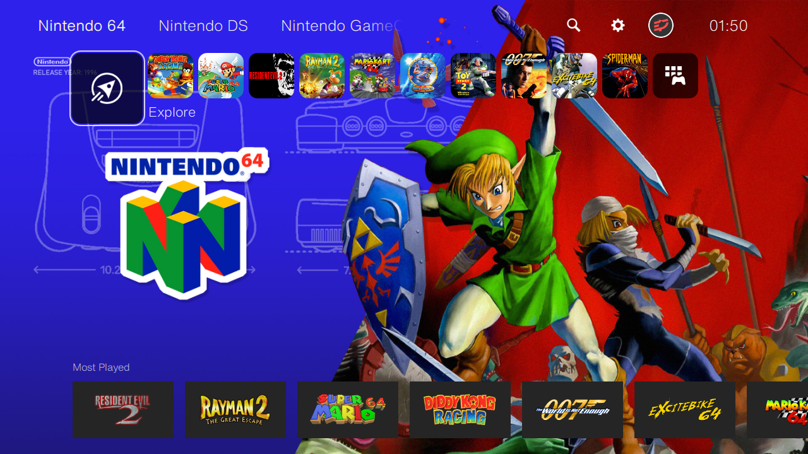
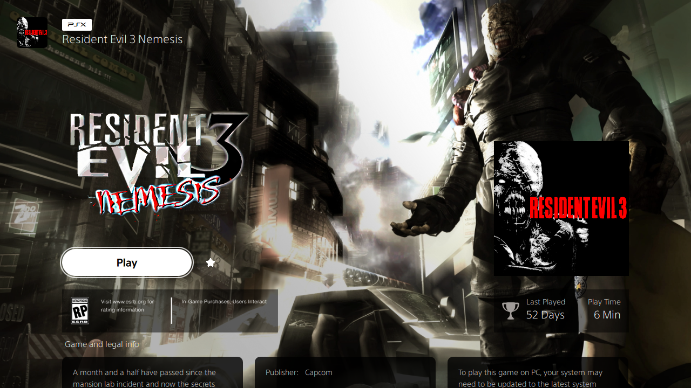

# oberonOS 

A [Pegasus Frontend](http://pegasus-frontend.org/) theme based on the Playstation 5 interface. It features a clean navigation with smart playlists to help you discover more from your collection.
Forked from [Seth Powell](https://github.com/PlayingKarrde)'s theme [prosperoOS](https://github.com/PlayingKarrde/prosperoOS).

***

  
<b>Screenshots</b>

  
  
  

  
***

## Changes & Features
- Added a new game column in Game Grid which now looks similar to PS5 interface
- Game Name is now inside the BoxArt (originally was outside) with a dark gradient to make it readable  
- Added short name vector to Game Detaiils and  Game Grid
- Game Bar margins, size and icon size are re-adjusted
- Added ESRB Rating, No of Playtime hours and Last time played date to Game Details
and more...
  
## Metadata in use
- boxFront (recommended to be with logo)
- logo
- banner

## Work in progress
- [ ] clean the code...
- [ ] add a search feature with a virtual keyboard
- [ ] missing backgrounds/logos for collections

## Thanks to:
- [Seth Powell](https://github.com/PlayingKarrde) : Creator of the original prosperoOS which this theme is based on
- [philgoodink](https://daijishou.github.io/Gallery/wallpapers_pack#POP!) : Creator of collection Wallpaper used in the theme

